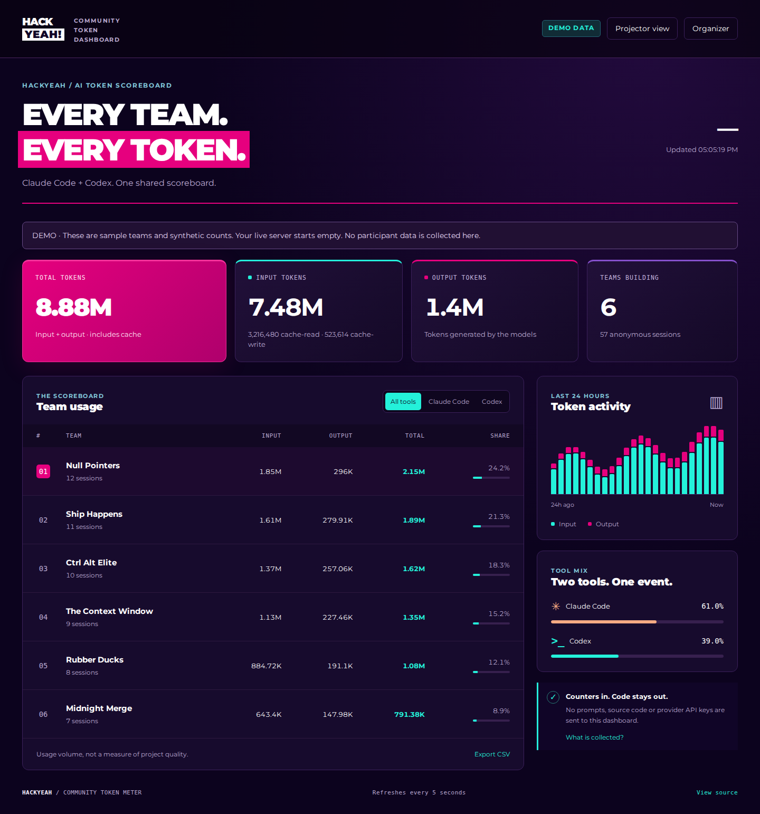

# HackYeah Token Dashboard

**Licznik tokenów dla zespołów na hackathonie — Claude Code + Codex CLI.**

Paczka odczytuje lokalne liczniki po zakończeniu tury i wysyła zużycie do wspólnego dashboardu. Widzisz tokeny **input/output**, cache, podział na narzędzia i ranking zespołów. Wygląd inspirowany [hackyeah.pl](https://hackyeah.pl/).

**Adres dashboardu:** https://hackyeah.elanon.pl · [Pełna instrukcja](docs/USAGE.md)

## Szybka instalacja uczestnika

Potrzebujesz **Node.js 22.13+** oraz nazwy zespołu i klucza od organizatora. W terminalu, w katalogu projektu:

```sh
npm install -g --ignore-scripts https://github.com/elanon1/hackyeah-token-dasboard/archive/refs/heads/main.tar.gz
htm join --server https://hackyeah.elanon.pl --team "Nazwa zespołu"
```

Potwierdź zgodę na zbieranie liczników i wklej klucz w ukrytym polu. **Uruchom ponownie Claude Code i Codex. W Codex wejdź w `/hooks` i zaakceptuj dodane hooki.** Instalacja konfiguruje oba narzędzia jednocześnie.

```sh
htm status          # sprawdź integracje i oczekujące raporty
htm sync --dry-run  # zobacz dokładnie, jakie dane zostaną wysłane
htm watch           # alternatywa dla starszych wersji bez hooków
htm pause           # wstrzymaj zbieranie
htm uninstall       # usuń nasze hooki, zachowując pozostałe
```

Zalecamy komendę przypiętą do konkretnej wersji, którą generuje dashboard organizatora. Powyższa instaluje bieżący `main`. Na Windows użyj `htm watch` lub WSL dla hooków.

## Co jest wysyłane?

**Nazwa zespołu, narzędzie, liczniki tokenów, czas i anonimowe identyfikatory do usuwania duplikatów.** Bez promptów, odpowiedzi, kodu, nazw plików i kluczy API OpenAI/Anthropic. Domyślnie tylko wybrany projekt i aktywność po dołączeniu. Zero zależności uruchomieniowych i skryptów instalacyjnych. [Prywatność](PRIVACY.md) · [Bezpieczeństwo](SECURITY.md).

To dane raportowane przez uczestników i dostępne w logach narzędzi — nie zweryfikowany rachunek ani system anty-cheat.

## Organizator

W dashboardzie podaj klucz administratora, utwórz zespoły i udostępnij każdemu jego klucz oraz komendę instalacji. Dla projektora użyj osobnego klucza tylko do odczytu.

Lokalne uruchomienie po sklonowaniu repozytorium:

```sh
npm ci --ignore-scripts
npm start           # http://localhost:4318
# npm run demo      # podgląd z wyraźnie oznaczonymi danymi przykładowymi
```

Klucze powstają w `.htm-data/server-secrets.json`. W Kubernetes:

```sh
kubectl -n hackyeah exec deployment/hackyeah-token-dashboard -- cat /data/server-secrets.json
```

Zachowaj wynik dla siebie: `adminKey` zarządza zespołami, `viewKey` pozwala oglądać dashboard. Wdrożenie w repozytorium `elanon1/argocd`: HTTPS, SQLite na trwałym wolumenie, jeden kontener bez uprawnień roota.

## Podgląd

Tryb demonstracyjny z przykładowymi zespołami; wdrożenie produkcyjne zaczyna od pustego rankingu.



## Dokumentacja

- [Pełna instrukcja i SDK](docs/USAGE.md)
- [Zgodność z Claude Code i Codex](docs/COMPATIBILITY.md)
- [HTTP API](docs/API.md)
- [Wdrożenie i kopie zapasowe](docs/DEPLOYMENT.md)

Testy: `npm test`. Paczka: `npm pack --ignore-scripts`. Pakiet instaluje się z GitHuba; publikacja w rejestrze npm wymaga osobnego uprawnionego konta. Kod: MIT. Montserrat: SIL Open Font License. Narzędzie społecznościowe, nieoficjalny produkt organizatora HackYeah.
